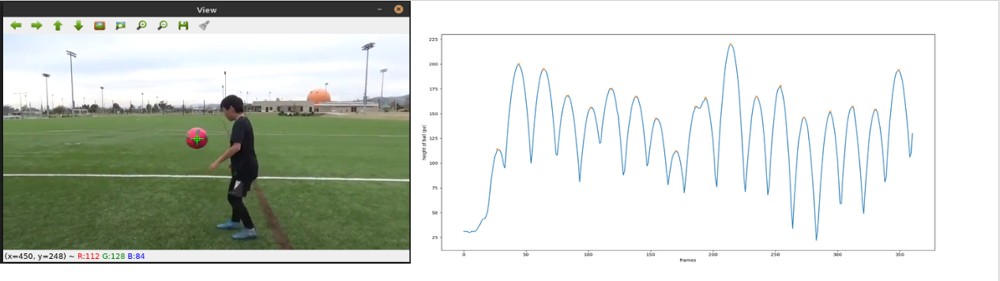

# Juggle Counter

## What problem does this solve?

My brother is getting very good at juggling a soccer ball and he records himself to count how many he has done after finishing. As you progress, this number can be in the thousands. Counting this number of juggles by hand to see if you broke your PB is not that fun. Instead, this program counts the number of juggles for you. Automation.

## Overview

The user selects the ball in order to track it with colors (HSV). The program runs quickly over the video and keeps into acount the ball's Y coordination with relation to the video's frame. After that's done, the program counts the number of peaks in the ball's coordinates, and that number is the number of juggles.

## Tech stack

- Python 3
- OpenCV - tracking and locating the ball
- SciPy - finding peaks
- Matplotlib - plotting and graphing
- NumPy - everything. NumPy is very useful

## Reflection and project improvements

Go [here.](docs/Reflection.md)

## How to run

`python3 src/counter_HSV.py path/to/juggling-soccer-ball-video.mov`